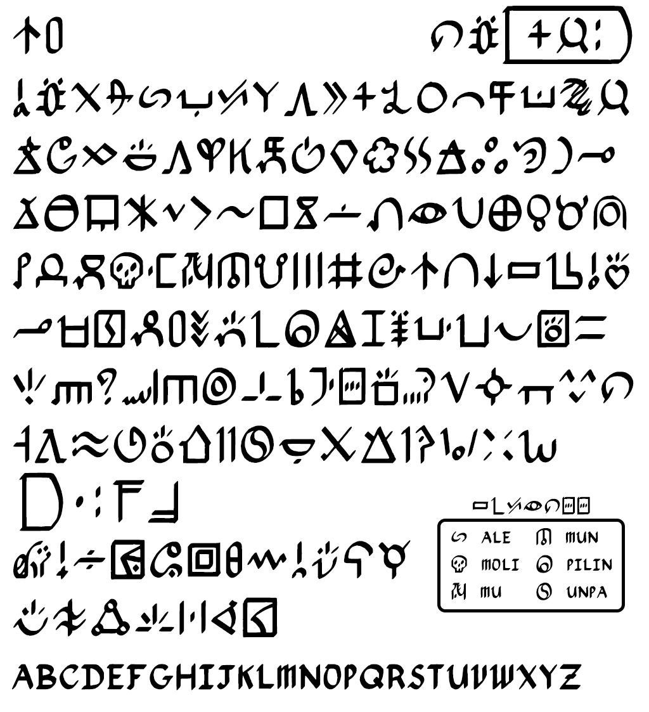

# nasin-palisa

A font for ambidirectional writing in sitelen pona.

## Usage
This script was designed to be used primarly in visual and written artworks such as the example below.

## Glyph Sources and Differences
The sitelen pona writing system is a public domain writing system for toki pona ([ISO tok](https://iso639-3.sil.org/code/tok)) made by [Sonja Lang](https://tokipona.org/).

This font uses [sitelen-sitelen](https://jonathangabel.com/toki-pona/) as the source of som glyphs. Specifically `ale mu mun pilin unpa`. 

The original sitelen pona glyphs for these words either did not match the style or were difficult to write with the angled brush.

---

Initial base font was generated with hand-drawn glyphs using [sp-font-maker](https://github.com/KelseyHigham/sp-font-maker) by waso Keli.

