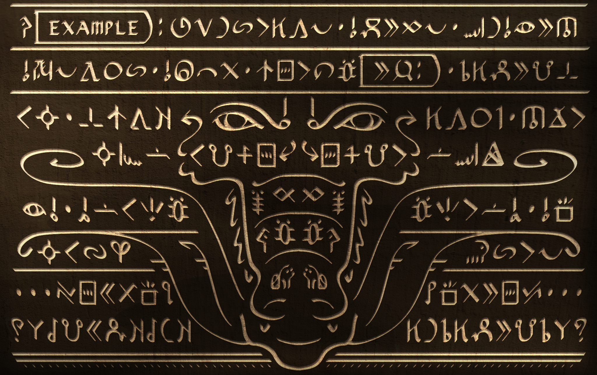

# nasin-palisa

A font for stylized, ambidirectional writing in sitelen pona art.

## Usage
This script was designed to be used primarly in visual and written artworks such as the example below.

> I am unaware of a way to make a font be inherently boustrophedonic. This example was typed and mirrored manually.

This font uses both latin ligatures of toki pona words and the sitelen pona private use area in unicode.

Latin text can be written by using capital letters. `akesi[NAME]` will produce a cartouche with NAME written in latin lettering.

> [!note]
> Kerning for cartouches only applies if there is no space between the bracket and preceding glyph.

## Glyph Sources and Differences
The sitelen pona writing system is a public domain writing system for toki pona ([ISO tok](https://iso639-3.sil.org/code/tok)) made by [Sonja Lang](https://tokipona.org/).

This font uses [sitelen-sitelen](https://jonathangabel.com/toki-pona/) as the source of some glyphs. Specifically `ale mu mun pilin unpa`. 

> The original sitelen pona glyphs for these words either did not match the style or were difficult to write with an angled brush.

## Creation

Base font was generated with hand-drawn glyphs using [sp-font-maker](https://github.com/KelseyHigham/sp-font-maker) by waso Keli.

Additional glyphs and features were added and made using [FontForge](https://fontforge.org).